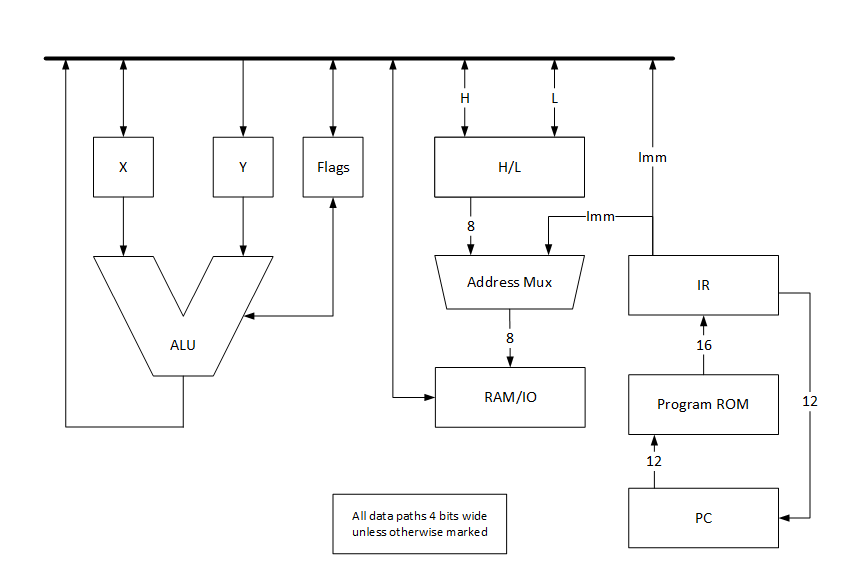

# Overview

The processor is driven by a 16-bit wide microprogram ROM with a 12-bit address. Each instruction directly controls the source that drives the 4-bit data bus and the destination that receives this data. 

Each instruction is either a branch instruction or a data movement instruction.

The ALU is implemented around a 74LS181, a 4-bit arithmetic logic unit (ALU) chip used in many early computers. Additional adders are integrated to allow direct Binary-Coded Decimal (BCD) operations. AND gates are used to provide a flag output for an all-ones result, indicating specific conditions during operations.

RAM and I/O address spaces are separate, but both are driven by the same address registers. The address bus can be driven either from the combined H/L registers or from the 4-bit immediate instruction field via zero-extension. This allows quick access to the first 16 memory and I/O addresses.

# Data path

## Data Registers

Four-bit registers:

* X, Y: ALU source registers
* Flags (set on ALU operations or explicit target)
  * C: ALU carry in/out (bit 0)
  * E: ALU equal (all ones output) (bit 1)
  * X: Auxiliary flag 1 (bit 2)
  * Y: Auxiliary flag 2 (bit 3)
* H/L: Address registers, combined to make an 8-bit address
  * H: High 4 bits of address (bits 7..4)
  * L: Low 4 bits of address (bits 3..0)
  * Optional post-increment/decrement

## Instruction Registers
* PC: Implemented with a 12-bit presettable counter
* IR: 16-bit 

## Memory
Memory is implemented with an Intel 2101 (or equivalent) 256 x 4-bit NMOS static RAM with separate read and write ports.

## I/O
Separate 4-bit data input and output ports are buffered to and from the internal data bus.

