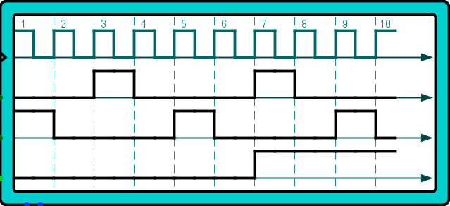

# Implementation notes

## Clock and power-on reset logic
The processor uses a two-phase non-overlapping clock derived from a TTL-compatible crystal oscillator module or an external input. This type of clock ensures that there are no overlapping periods where both phases are active, which helps to avoid timing issues and race conditions in the processor's operation. An entire two-phase instruction cycle takes 4 input clock cycles to complete, allowing for precise control and synchronization of the processor's activities. Additionally, a power-on reset circuit keeps the reset line asserted for at least one whole instruction cycle, ensuring that the processor starts in a known state and deasserting at the beginning of the instruction cycle to begin normal operation.

In the above plot, the top line is the input clock, the next two are the outputs of the two-phase clock generator circuit, and the bottom line is the active-low reset signal. The input clock drives the two-phase clock generator, producing two non-overlapping clock phases. These phases ensure that certain operations occur in distinct time periods, preventing conflicts. The reset signal is asserted low during power-on, holding the processor in a reset state. Once the reset signal is deasserted, the processor begins normal operation synchronized with the clock phases.

## Clock phases
* Phase 1 rising: Instruction register flip-flop loads the output of the instruction ROMs. 
* Phase 1 falling: Output of the address multiplexer is latched onto the address bus.
* Phase 2 rising: Contents of data bus is latched into destination flip-flops.
* Phase 2 falling: Memory write is de-asserted if destination is memory.

## ALU Circuit and BCD Mode Operations
The Arithmetic Logic Unit (ALU) is responsible for performing arithmetic and logical operations within the processor.

In non-BCD mode, the contents of the X and Y registers are passed unchanged to the 74LS181 ALU inputs. The ALU output is then passed unchanged to the data bus driver. 

BCD mode behavior differs between addition and subtraction.

When adding, the value of the Y register is always pre-incremented by 6 before being passed to the 74LS181 input. This pre-increment ensures that any result greater than 9 will generate a carry, which is necessary for correct BCD addition. Without this pre-increment, the ALU would not correctly handle decimal carries, leading to incorrect results.

When subtracting, the value of the Y register is not pre-incremented because BCD subtraction does not require this adjustment.

For all BCD operations, if there is no carry output, the ALU output is incremented by 10. This is equivalent to subtracting 6 in 2s-complement representation. 

For BCD addition, this adjustment is necessary to correct the result of an addition without carry out. This is because the input was pre-incremented by 6. If there was a carry, the result would need to be incremented by 6 anyway for proper BCD correction. This ensures that the final result is a valid BCD digit.

For BCD subtraction, if there is no carry out, it indicates that Y is larger than X, resulting in a negative output. This means a borrow from the next higher decimal digit is needed, and the result should be incremented by 10.

AND gates connected to the ALU output set the "equal" flag when all bits of the output are set. This is useful in combination with the subtract operation without the carry flag set to effectively compare the X and Y registers. 

The subtract operation is X - Y - 1 + C. When X and Y are equal, the result will be -1. In 2s-complement notation, this results in an output with all bits set. This, along with the carry flag, can be used to determine if Y is less than, greater than, or equal to X.
